---
## Front matter
title: "Отчёт по лабораторной работе №3"
author: "Тарутина Кристина Олеговна"

## Generic otions
lang: ru-RU
toc-title: "Содержание"

## Bibliography
bibliography: bib/cite.bib
csl: pandoc/csl/gost-r-7-0-5-2008-numeric.csl

## Pdf output format
toc: true # Table of contents
toc-depth: 2
lof: true # List of figures
lot: true # List of tables
fontsize: 12pt
linestretch: 1.5
papersize: a4
documentclass: scrreprt
## I18n polyglossia
polyglossia-lang:
  name: russian
  options:
	- spelling=modern
	- babelshorthands=true
polyglossia-otherlangs:
  name: english
## I18n babel
babel-lang: russian
babel-otherlangs: english
## Fonts
mainfont: PT Serif
romanfont: PT Serif
sansfont: PT Sans
monofont: PT Mono
mainfontoptions: Ligatures=TeX
romanfontoptions: Ligatures=TeX
sansfontoptions: Ligatures=TeX,Scale=MatchLowercase
monofontoptions: Scale=MatchLowercase,Scale=0.9
## Biblatex
biblatex: true
biblio-style: "gost-numeric"
biblatexoptions:
  - parentracker=true
  - backend=biber
  - hyperref=auto
  - language=auto
  - autolang=other*
  - citestyle=gost-numeric
## Pandoc-crossref LaTeX customization
figureTitle: "Рис."
tableTitle: "Таблица"
listingTitle: "Листинг"
lofTitle: "Список иллюстраций"
lotTitle: "Список таблиц"
lolTitle: "Листинги"
## Misc options
indent: true
header-includes:
  - \usepackage{indentfirst}
  - \usepackage{float} # keep figures where there are in the text
  - \floatplacement{figure}{H} # keep figures where there are in the text
---

# Цель работы

Целью работы является изучить идеологию и применение средств контроля версий. Приобрести практические навыки по работе с системой git.

# Выполнение лабораторной работы
Так как у меня уже была учётная запись на github, то этот шаг я пропустила
Делаю предварительную конфигурацию git. Открываю терминал и ввожу следующие команды, указав своё имя и email. Настраиваю utf-8 в выводе сообщений git. Задаю имя начальной ветки, Параметр autocrlf и параметр safecrlf (рис. [-@fig:001])

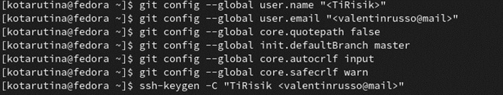{ #fig:001 width=70% }

Для последующей идентификации пользователя на сервере репозиториев генерирую пару ключей (приватный и открытый)((рис. [-@fig:002])

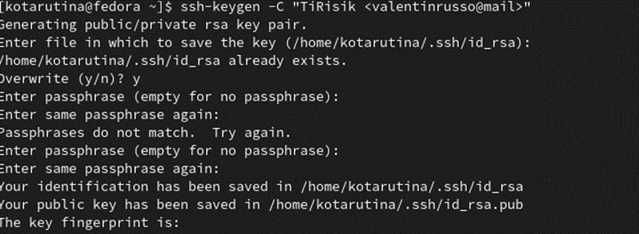{ #fig:002 width=70% }

Загружаю сгенерированный открытый ключ. Для этого захожу на сайт http://github.org/ под своей учётной записью и перехожу в меню Setting . После этого выбираю в боковом меню SSH and GPG keys и нажимаю кнопку New SSH key . 

Устанавливаю пакет xclip и копирую из локальной консоли ключ в буфер обмена (рис. [-@fig:003])

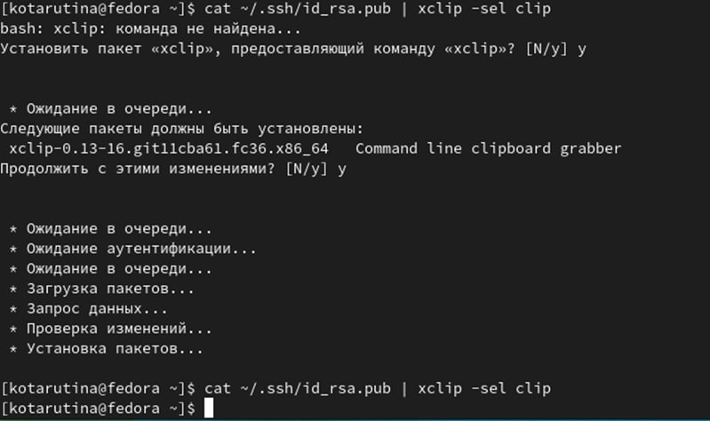{ #fig:003 width=70% }

Вставляю ключ в появившееся на сайте поле и указываем для ключа имя (здесь я, к сожалению, забыла сделать скриншот)

Создаю каталог для предмета «Архитектура компьютера» (рис. [-@fig:004])

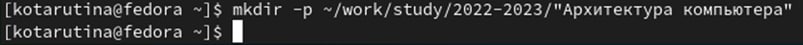{ #fig:004 width=70% }

Перехожу на станицу репозитория с шаблоном курса, выбираю Use this template. В открывшемся окне задаю имя репозитория study_2022–2023_arh-pc и создаю репозиторий (рис. [-@fig:005])

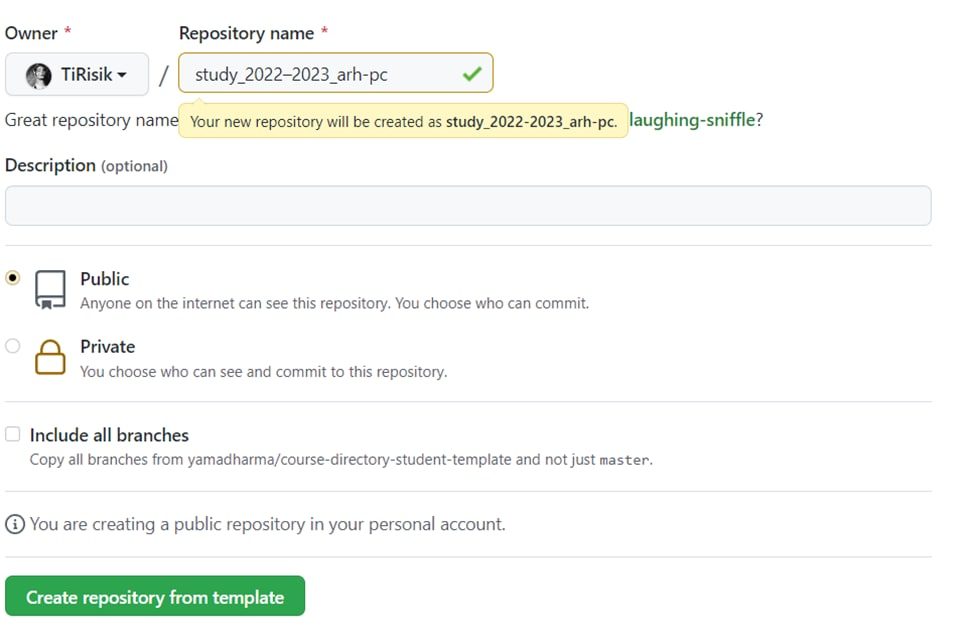{ #fig:005 width=70% }

В терминале перехожу в каталог курса, клонирую созданный репозиторий, ссылку для клонирования копирую на странице созданного репозитория (рис. [-@fig:006])

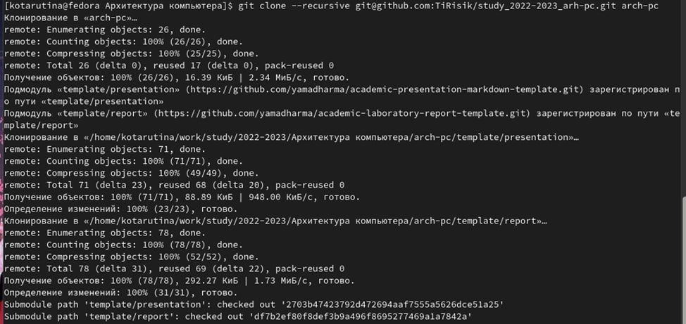{ #fig:006 width=70% }

Перехожу в каталог курса. Удаляю лишние файлы. Создаю необходимые каталоги (рис. [-@fig:007])

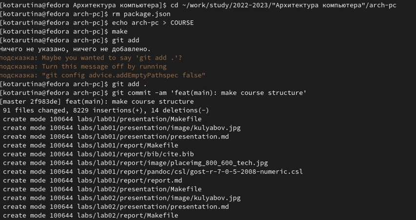{ #fig:007 width=70% }

Отправляю файлы на сервер (рис. [-@fig:008])

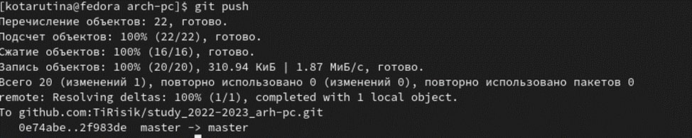{ #fig:008 width=70% }

Проверяю правильность создания иерархии рабочего пространства в локальном репозитории и на странице github. (рис. [-@fig:009])(рис. [-@fig:0010])

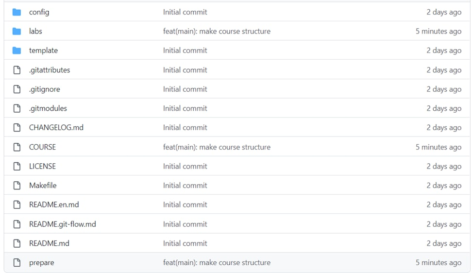{ #fig:009 width=70% }

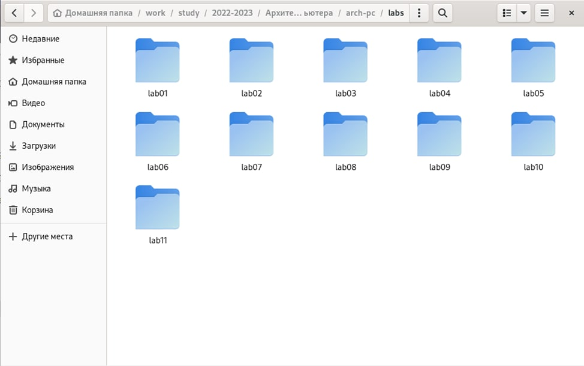{ #fig:0010 width=70% }

# Выполнение самостоятельной работы

Создала отчёт в соответствующем каталоге(рис. [-@fig:0011])

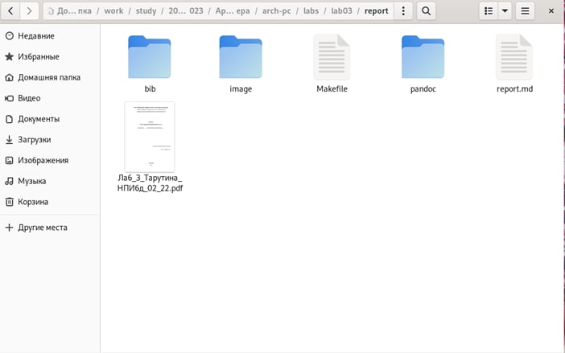{ #fig:0011 width=70% }

Скопировала отчёты в соответствующие им каталоги (рис. [-@fig:0012])рис. [-@fig:0013])

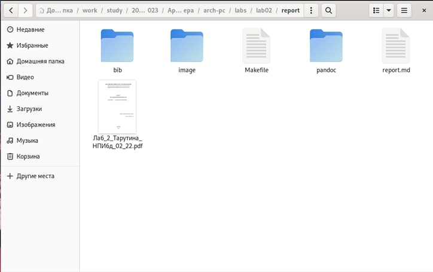{ #fig:0012 width=70% }

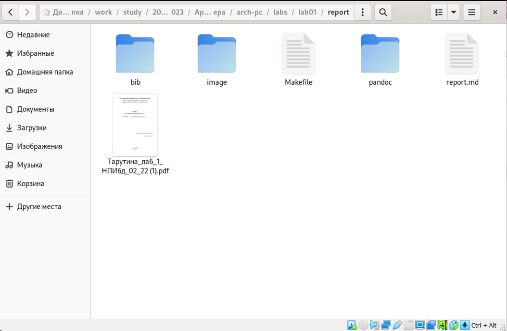{ #fig:0013 width=70% }

Загрузила файлы с помощью команд, изображённых на рисунке 14

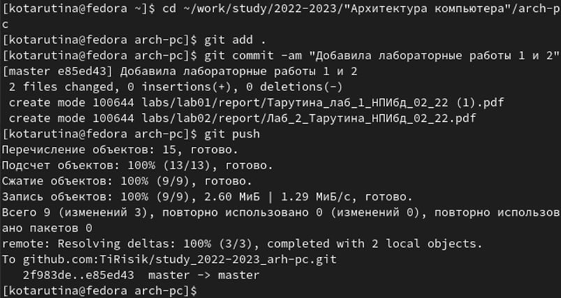{ #fig:0014 width=70% }

# Выводы

Изучили идеологию и применение средств контроля версий. Приобрели практические навыки по работе с системой git.

