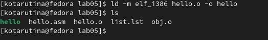

---
## Front matter
title: "Отчёт по лабораторной работе №5"
author: "Тарутина Кристина Олеговна"

## Generic otions
lang: ru-RU
toc-title: "Содержание"

## Bibliography
bibliography: bib/cite.bib
csl: pandoc/csl/gost-r-7-0-5-2008-numeric.csl

## Pdf output format
toc: true # Table of contents
toc-depth: 2
lof: true # List of figures
lot: true # List of tables
fontsize: 12pt
linestretch: 1.5
papersize: a4
documentclass: scrreprt
## I18n polyglossia
polyglossia-lang:
  name: russian
  options:
	- spelling=modern
	- babelshorthands=true
polyglossia-otherlangs:
  name: english
## I18n babel
babel-lang: russian
babel-otherlangs: english
## Fonts
mainfont: PT Serif
romanfont: PT Serif
sansfont: PT Sans
monofont: PT Mono
mainfontoptions: Ligatures=TeX
romanfontoptions: Ligatures=TeX
sansfontoptions: Ligatures=TeX,Scale=MatchLowercase
monofontoptions: Scale=MatchLowercase,Scale=0.9
## Biblatex
biblatex: true
biblio-style: "gost-numeric"
biblatexoptions:
  - parentracker=true
  - backend=biber
  - hyperref=auto
  - language=auto
  - autolang=other*
  - citestyle=gost-numeric
## Pandoc-crossref LaTeX customization
figureTitle: "Рис."
tableTitle: "Таблица"
listingTitle: "Листинг"
lofTitle: "Список иллюстраций"
lotTitle: "Список таблиц"
lolTitle: "Листинги"
## Misc options
indent: true
header-includes:
  - \usepackage{indentfirst}
  - \usepackage{float} # keep figures where there are in the text
  - \floatplacement{figure}{H} # keep figures where there are in the text
---

# Цель работы

Освоение процедуры компиляции и сборки программ, написанных на ассемблере NASM.

# Выполнение лабораторной работы
Создаём и переходим в каталог для работы с программами на языке ассемблера NASM (рис. [-@fig:001])

{ #fig:001 width=70% }

Создаём текстовый файл с именем hello.asm открываем этот файл с помощью любого текстового редактора(рис. [-@fig:002])

{ #fig:002 width=70% }

Вводим в него программу(рис. [-@fig:003])

{ #fig:003 width=70% }

Компилируем текст программы (рис. [-@fig:004])
КомпилируеМ исходный файл hello.asm в obj.o и проверяем создание файлов(рис. [-@fig:004])

{ #fig:004 width=70% }

Передаём объектный файл на обработку компоновщику и проверяем создание файлов(рис. [-@fig:005])

{ #fig:005 width=70% }

Передаём объектный файл obj.o на обработку компоновщику и проверяем создание файлов(рис. [-@fig:006])

{ #fig:006 width=70% }

Запускаем файл(рис. [-@fig:007])

{ #fig:007 width=70% }

# Выполнение самостоятельной работы

В каталоге ~/work/arch-pc/lab05 с помощью команды cp создаём копию
файла hello.asm с именем lab5.asm(рис. [-@fig:008])

{ #fig:008 width=70% }

С помощью любого текстового редактора вносим изменения в текст программы в файле lab5.asm так, чтобы вместо Hello world! на экран выводилась строка с фамилией и именем(рис. [-@fig:009])

{ #fig:009 width=70% }

Транслируем полученный текст программы lab5.asm в объектный
файл. (рис. [-@fig:0010])

{ #fig:0010 width=70% }

Выполняем компоновку объектного файла и запускаем получившийся исполняемый файл.(рис. [-@fig:0011])

{ #fig:0011 width=70% }

Копируем файлы hello.asm и lab5.asm в  локальный репозиторий
в каталог ~/work/study/2022-2023/"Архитектура компьютера"/archpc/labs/lab05/(рис. [-@fig:0012])

{ #fig:0012 width=70% }

# Выводы

Освоение процедуры компиляции и сборки программ, написанных на ассемблере NASM прошло успешно

