---
## Front matter
title: "Отчёт по лабораторной работе №6"
author: "Тарутина Кристина Олеговна"

## Generic otions
lang: ru-RU
toc-title: "Содержание"

## Bibliography
bibliography: bib/cite.bib
csl: pandoc/csl/gost-r-7-0-5-2008-numeric.csl

## Pdf output format
toc: true # Table of contents
toc-depth: 2
lof: true # List of figures
lot: true # List of tables
fontsize: 12pt
linestretch: 1.5
papersize: a4
documentclass: scrreprt
## I18n polyglossia
polyglossia-lang:
  name: russian
  options:
	- spelling=modern
	- babelshorthands=true
polyglossia-otherlangs:
  name: english
## I18n babel
babel-lang: russian
babel-otherlangs: english
## Fonts
mainfont: PT Serif
romanfont: PT Serif
sansfont: PT Sans
monofont: PT Mono
mainfontoptions: Ligatures=TeX
romanfontoptions: Ligatures=TeX
sansfontoptions: Ligatures=TeX,Scale=MatchLowercase
monofontoptions: Scale=MatchLowercase,Scale=0.9
## Biblatex
biblatex: true
biblio-style: "gost-numeric"
biblatexoptions:
  - parentracker=true
  - backend=biber
  - hyperref=auto
  - language=auto
  - autolang=other*
  - citestyle=gost-numeric
## Pandoc-crossref LaTeX customization
figureTitle: "Рис."
tableTitle: "Таблица"
listingTitle: "Листинг"
lofTitle: "Список иллюстраций"
lotTitle: "Список таблиц"
lolTitle: "Листинги"
## Misc options
indent: true
header-includes:
  - \usepackage{indentfirst}
  - \usepackage{float} # keep figures where there are in the text
  - \floatplacement{figure}{H} # keep figures where there are in the text
---

# Цель работы

Приобретение практических навыков работы в Midnight Commander. Освоение
инструкций языка ассемблера mov и int

# Выполнение лабораторной работы
Открываю Midnight Commander
Пользуясь клавишами ↑ , ↓ и Enter перехожу в каталог ~/work/archpc созданный при выполнении лабораторной работы №5(рис. [-@fig:001])

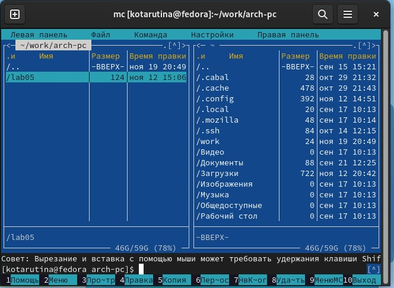{ #fig:001 width=70% }

С помощью функциональной клавиши F7 создаю папку lab06 и перехожу в созданный каталог.(рис. [-@fig:002])

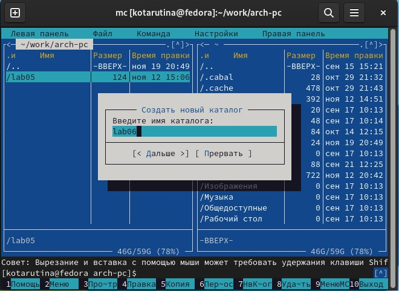{ #fig:002 width=70% }

Пользуясь строкой ввода и командой touch создаю файл lab6.asm(рис. [-@fig:003])

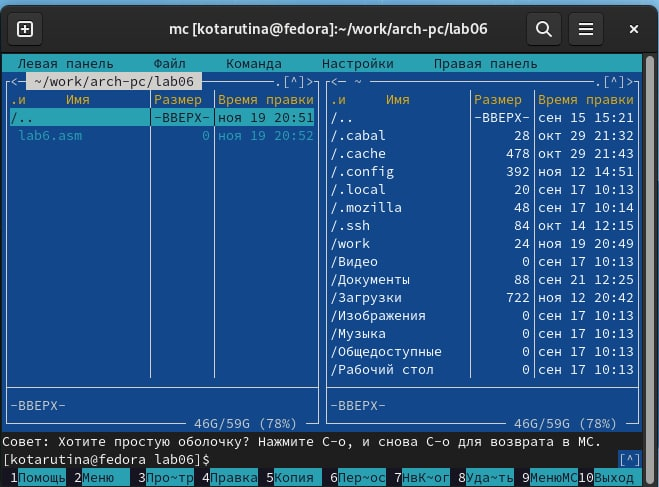{ #fig:003 width=70% }

С помощью функциональной клавиши F4 открываю файл lab6.asm для редактирования во встроенном редакторе. Ввожу код программы(рис. [-@fig:004])

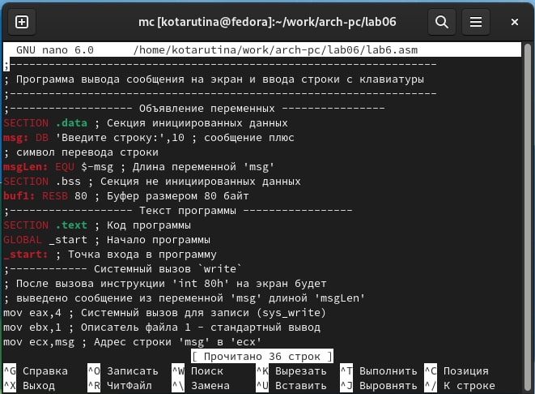{ #fig:004 width=70% }

Транслирую текст программы lab6.asm в объектный файл. Выполняю компоновку объектного файла и запускаю получившийся исполняемый
файл. Программа выводит строку 'Введите строку:' и ожидает ввода с
клавиатуры. На запрос ввожу своё ФИО.(рис. [-@fig:005])

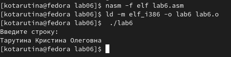{ #fig:005 width=70% }

Скачиваю файл in_out.asm в папку lab06 с ТУИС(рис. [-@fig:006])

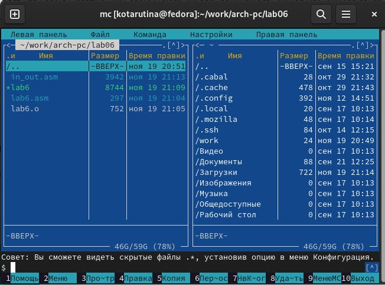{ #fig:006 width=70% }

С помощью функциональной клавиши F6 создаю копию файла lab6.asm с именем lab6-2.asm.(рис. [-@fig:007])

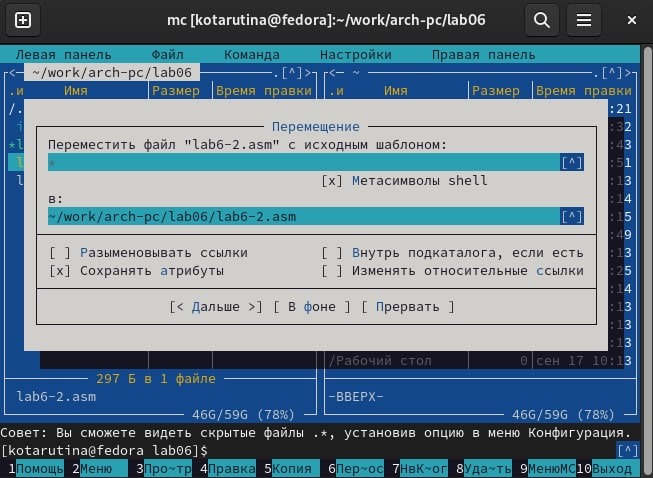{ #fig:007 width=70% }

Исправляю текст программы в файле lab6-2.asm с использование подпрограмм из внешнего файла in_out.asm (рис. [-@fig:008])

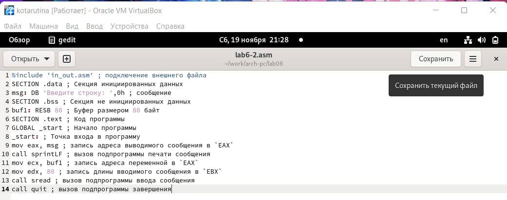{ #fig:008 width=70% }

Создайте исполняемый файл и проверьте его работу(рис. [-@fig:009])

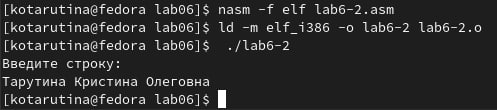{ #fig:009 width=70% }

В файле lab6-2.asm заменяю подпрограмму sprintLF на sprint. Создаю исполняемый файл и проверяю его работу. В отличии от предыдущей программы нет перехода курсора на строку ниже(рис. [-@fig:0010])

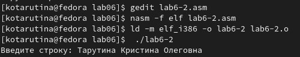{ #fig:0010 width=70% }

# Выполнение самостоятельной работы

Создаю копию файла lab6.asm. Вношу изменения в программу (без
использования внешнего файла in_out.asm)(рис. [-@fig:0011])

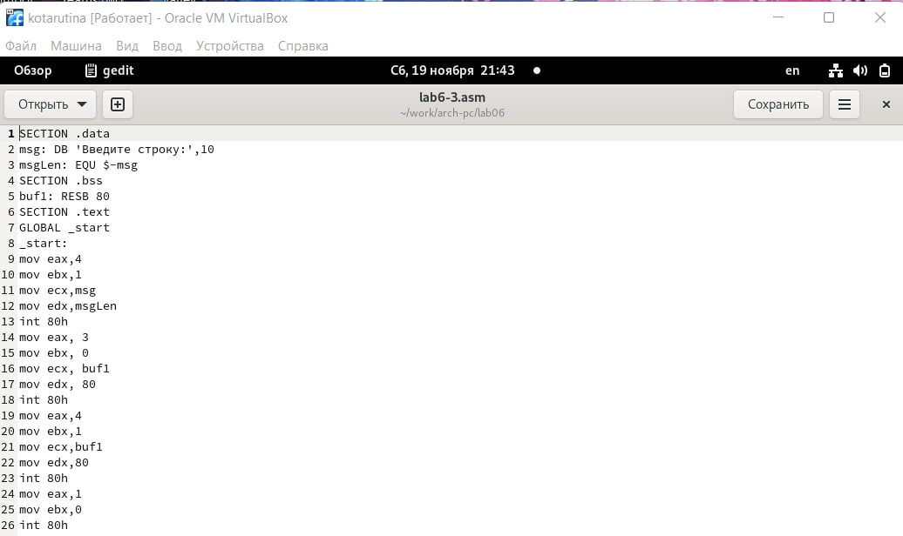{ #fig:0011 width=70% }

Получаю исполняемый файл и проверяю его работу. На приглашение
ввести строку ввожу свою фамилию.(рис. [-@fig:0012])

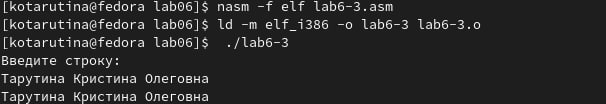{ #fig:0012 width=70% }

Создаю копию файла lab6-2.asm. Исправляю текст программы с использование подпрограмм из внешнего файла in_out.asm,(рис. [-@fig:0013])

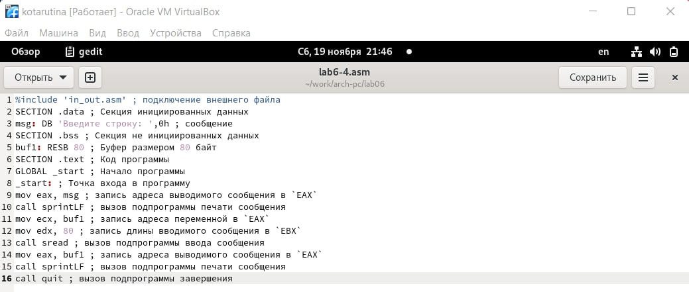{ #fig:0013 width=70% }

Создаю исполняемый файл и проверяю его работу(рис. [-@fig:0014])

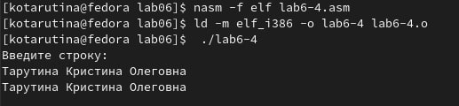{ #fig:0014 width=70% }

# Выводы

Приобретение практических навыков работы в Midnight Commander, освоение
инструкций языка ассемблера mov и int прошло успешно

