---
## Front matter
title: "Отчёт по лабораторной работе №7"
author: "Тарутина Кристина Олеговна"

## Generic otions
lang: ru-RU
toc-title: "Содержание"

## Bibliography
bibliography: bib/cite.bib
csl: pandoc/csl/gost-r-7-0-5-2008-numeric.csl

## Pdf output format
toc: true # Table of contents
toc-depth: 2
lof: true # List of figures
lot: true # List of tables
fontsize: 12pt
linestretch: 1.5
papersize: a4
documentclass: scrreprt
## I18n polyglossia
polyglossia-lang:
  name: russian
  options:
	- spelling=modern
	- babelshorthands=true
polyglossia-otherlangs:
  name: english
## I18n babel
babel-lang: russian
babel-otherlangs: english
## Fonts
mainfont: PT Serif
romanfont: PT Serif
sansfont: PT Sans
monofont: PT Mono
mainfontoptions: Ligatures=TeX
romanfontoptions: Ligatures=TeX
sansfontoptions: Ligatures=TeX,Scale=MatchLowercase
monofontoptions: Scale=MatchLowercase,Scale=0.9
## Biblatex
biblatex: true
biblio-style: "gost-numeric"
biblatexoptions:
  - parentracker=true
  - backend=biber
  - hyperref=auto
  - language=auto
  - autolang=other*
  - citestyle=gost-numeric
## Pandoc-crossref LaTeX customization
figureTitle: "Рис."
tableTitle: "Таблица"
listingTitle: "Листинг"
lofTitle: "Список иллюстраций"
lotTitle: "Список таблиц"
lolTitle: "Листинги"
## Misc options
indent: true
header-includes:
  - \usepackage{indentfirst}
  - \usepackage{float} # keep figures where there are in the text
  - \floatplacement{figure}{H} # keep figures where there are in the text
---

# Цель работы

Освоение арифметических инструкций языка ассемблера NASM

# Выполнение лабораторной работы
Создаю каталог для программам лабораторной работы № 7, перехожу в
него и создаю файл lab7-1.asm(рис. [-@fig:001])

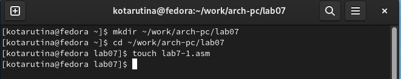{ #fig:001 width=70% }

Ввожу в файл lab7-1.asm текст программы из листинга 7.1(рис. [-@fig:002])

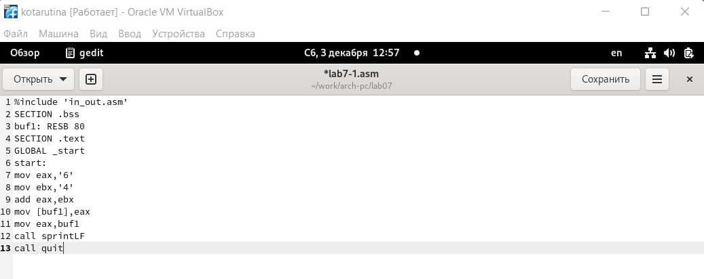{ #fig:002 width=70% }

Создаю исполняемый файл и запускаю его.(рис. [-@fig:003])

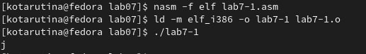{ #fig:003 width=70% }

Изменяю текст программы (рис. [-@fig:004])

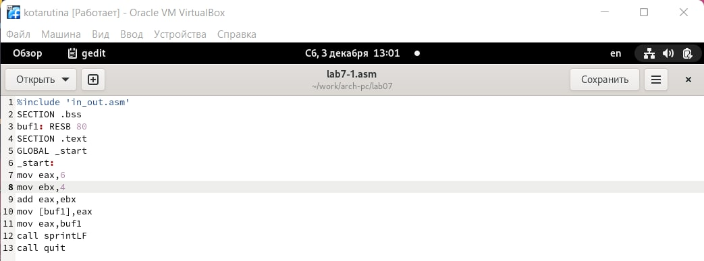{ #fig:004 width=70% }

Создаю исполняемый файл и проверяю его работу(рис. [-@fig:005])
Да, при выводе на экран символ отображается, так как символ с этим кодом это символ переноса строки, то и видим мы перенос строки

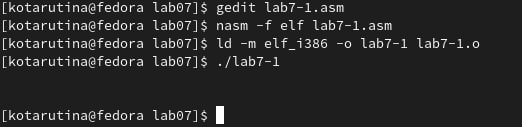{ #fig:005 width=70% }

Создаю файл lab7-2.asm(рис. [-@fig:006]) 

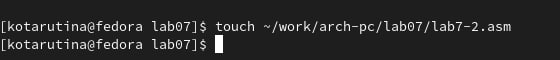{ #fig:006 width=70% }

Ввожу в него код из Листинга 7.2(рис. [-@fig:007])

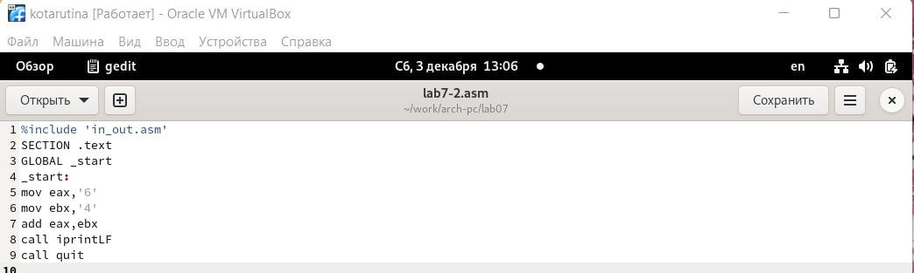{ #fig:007 width=70% }

Создаю исполняемый файл и запускаю его(рис. [-@fig:008]) 

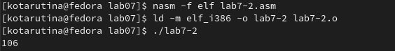{ #fig:008 width=70% }

Изменяю код программы(рис. [-@fig:009])

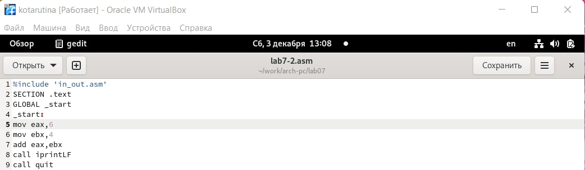{ #fig:009 width=70% }

Создаю исполняемый файл и проверяю его работу. В результате мы получим число 10 при исполнении команды(рис. [-@fig:0010])

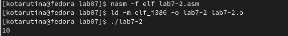{ #fig:0010 width=70% }

В тексте программы заменяю функцию iprintLF на iprint(рис. [-@fig:0011]) 

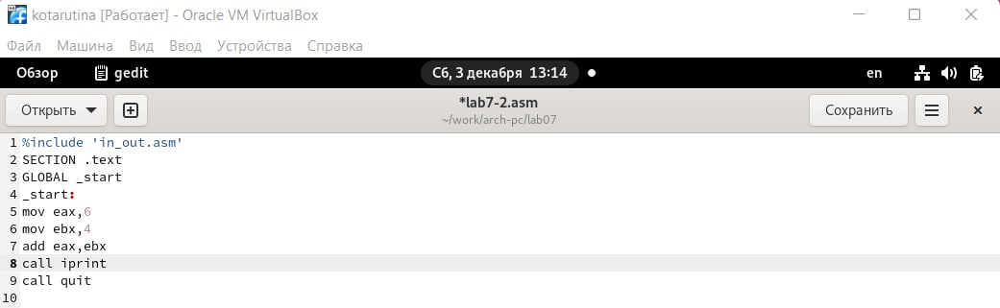{ #fig:0011 width=70% }

Создаю исполняемый файл и запускаю его. При смене функции после результата программа не вывела символ переноса строки(рис. [-@fig:0012])

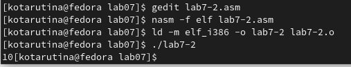{ #fig:0012 width=70% }

Создаю файл lab7-3.asm в каталоге ~/work/arch-pc/lab07
Внимательно изучаю текст программы из листинга 7.3 и ввожу в lab7-
3.asm. (рис. [-@fig:0013])

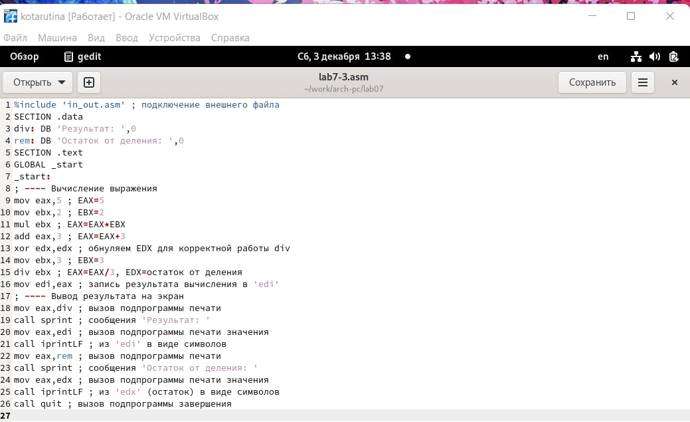{ #fig:0013 width=70% }

Создаю исполняемый файл и запускаю его.(рис. [-@fig:0014])

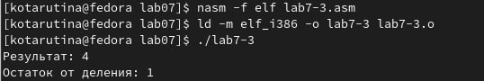{ #fig:0014 width=70% }

Изменяю текст программы для вычисления выражения 𝑓(𝑥) = (4 ∗ 6 + 2)/5(рис. [-@fig:0015])

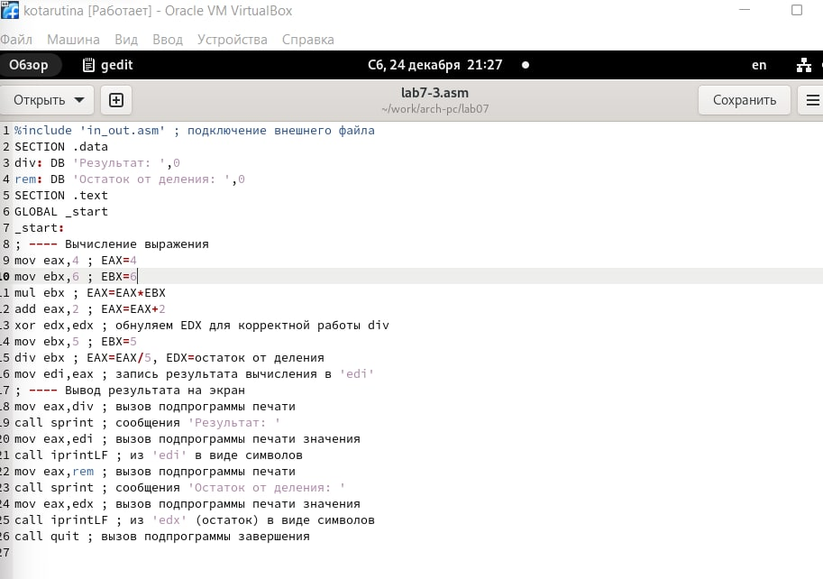{ #fig:0015 width=70% }

Создаю исполняемый файл и проверяю его работу.(рис. [-@fig:0016])

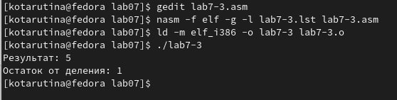{ #fig:0016 width=70% }

Создаю файл variant.asm в каталоге ~/work/arch-pc/lab07(рис. [-@fig:0017])

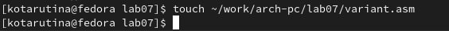{ #fig:0017 width=70% }

Внимательно изучаю текст программы из листинга 7.4 и ввожу в файл
variant.asm.
(рис. [-@fig:0018])

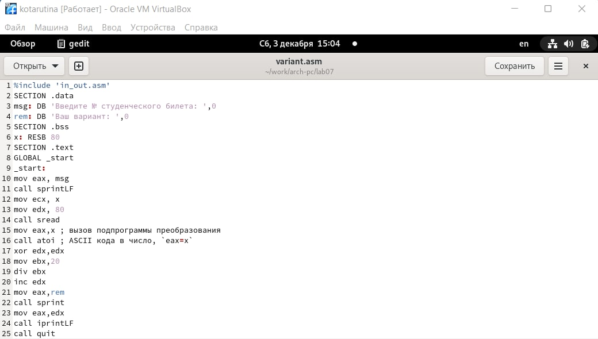{ #fig:0018 width=70% }

Создаю исполняемый файл и запускаю его.(рис. [-@fig:0019])
Аналитически проверю. Программа корректна

Ответы на вопросы:

1. Какие строки листинга 7.4 отвечают за вывод на экран сообщения ‘Ваш
вариант:’?

mov eax,rem

call sprint

2. Для чего используется следующие инструкции? nasm mov ecx, x
mov edx, 80 call sread

Для считывания номера студ. билета

3. Для чего используется инструкция “call atoi”?

Для преобразования ASCII кода в число

4. Какие строки листинга 7.4 отвечают за вычисления варианта?

mov ebx,20

div ebx

inc edx

5. В какой регистр записывается остаток от деления при выполнении инструкции “div ebx”?

edx

6. Для чего используется инструкция “inc edx”?

Для прибавления единицы к остатку

7. Какие строки листинга 7.4 отвечают за вывод на экран результата вычислений?

mov eax,edx

call iprintLF

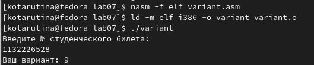{ #fig:0019 width=70% }

# Выполнение самостоятельной работы

Пишу программу вычисления выражения 𝑦 = 𝑓(𝑥), y = 10 + (31𝑥 − 5) (вариант 9). (рис. [-@fig:0020])

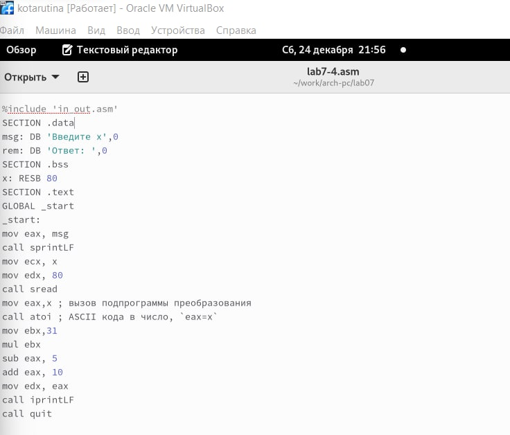{ #fig:0020 width=70% }

Создаю исполняемый файл и проверяю его
работу для значений 𝑥1 и 𝑥2 (рис. [-@fig:0021])

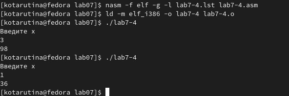{ #fig:0021 width=70% }

# Выводы

Освоение арифметических инструкций языка ассемблера NASM прошло успешно

