---
## Front matter
title: "Отчёт по лабораторной работе №8"
author: "Тарутина Кристина Олеговна"

## Generic otions
lang: ru-RU
toc-title: "Содержание"

## Bibliography
bibliography: bib/cite.bib
csl: pandoc/csl/gost-r-7-0-5-2008-numeric.csl

## Pdf output format
toc: true # Table of contents
toc-depth: 2
lof: true # List of figures
lot: true # List of tables
fontsize: 12pt
linestretch: 1.5
papersize: a4
documentclass: scrreprt
## I18n polyglossia
polyglossia-lang:
  name: russian
  options:
	- spelling=modern
	- babelshorthands=true
polyglossia-otherlangs:
  name: english
## I18n babel
babel-lang: russian
babel-otherlangs: english
## Fonts
mainfont: PT Serif
romanfont: PT Serif
sansfont: PT Sans
monofont: PT Mono
mainfontoptions: Ligatures=TeX
romanfontoptions: Ligatures=TeX
sansfontoptions: Ligatures=TeX,Scale=MatchLowercase
monofontoptions: Scale=MatchLowercase,Scale=0.9
## Biblatex
biblatex: true
biblio-style: "gost-numeric"
biblatexoptions:
  - parentracker=true
  - backend=biber
  - hyperref=auto
  - language=auto
  - autolang=other*
  - citestyle=gost-numeric
## Pandoc-crossref LaTeX customization
figureTitle: "Рис."
tableTitle: "Таблица"
listingTitle: "Листинг"
lofTitle: "Список иллюстраций"
lotTitle: "Список таблиц"
lolTitle: "Листинги"
## Misc options
indent: true
header-includes:
  - \usepackage{indentfirst}
  - \usepackage{float} # keep figures where there are in the text
  - \floatplacement{figure}{H} # keep figures where there are in the text
---

# Цель работы

Изучение команд условного и безусловного переходов. Приобретение навыков написания программ с использованием переходов. Знакомство с назначением и структурой файла листинга.

# Выполнение лабораторной работы
Создаю каталог для программам лабораторной работы № 8, перейхожу в
него и создаю файл lab8-1.asm(рис. [-@fig:001])

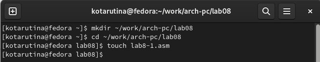{ #fig:001 width=70% }

Ввожу в файл lab8-1.asm текст программы из листинга 8.1(рис. [-@fig:002])

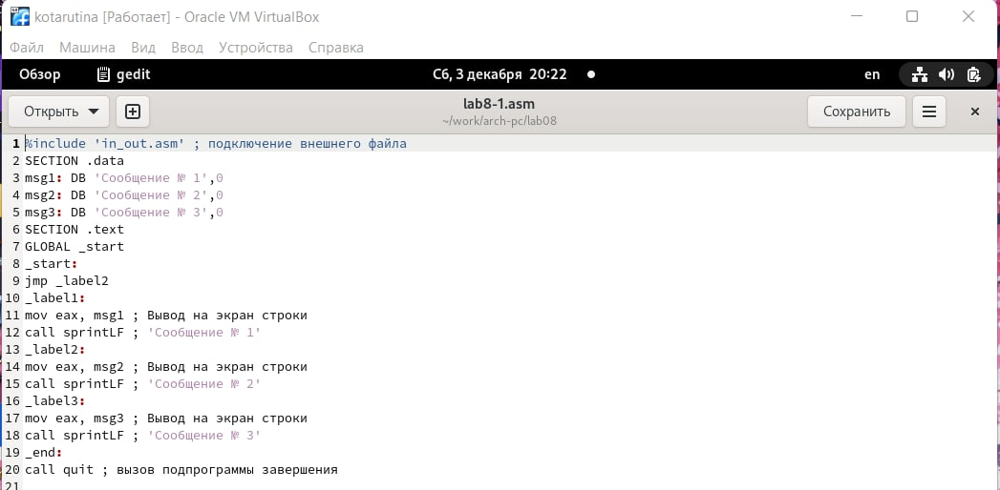{ #fig:002 width=70% }

Создаю исполняемый файл и запускаю его.(рис. [-@fig:003])

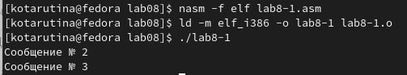{ #fig:003 width=70% }

Изменяю текст программы в соответствии с листингом 8.2(рис. [-@fig:004])

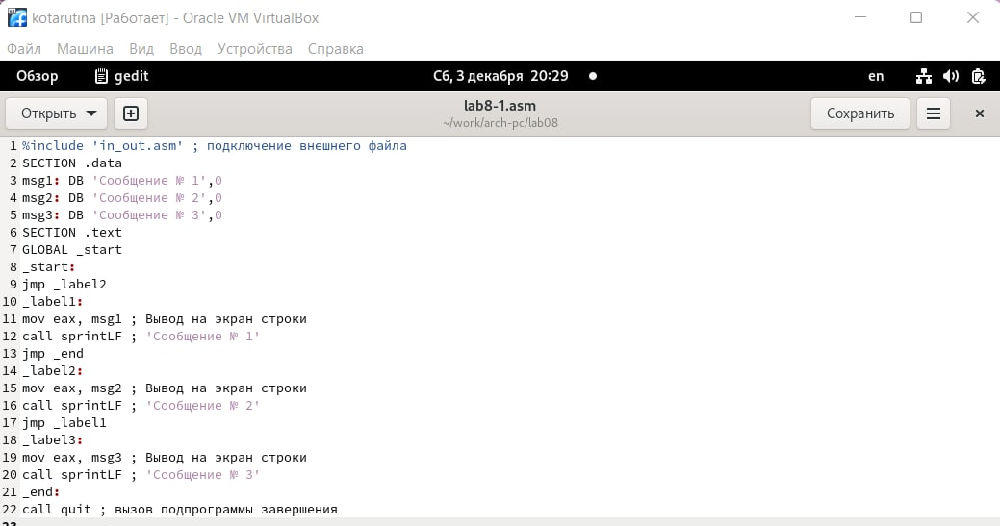{ #fig:004 width=70% }

Создаю исполняемый файл и проверяю его работу(рис. [-@fig:005])

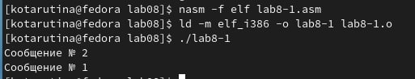{ #fig:005 width=70% }

Изменяю текст программы(рис. [-@fig:006]) чтобы вывод был следующим (рис. [-@fig:007])

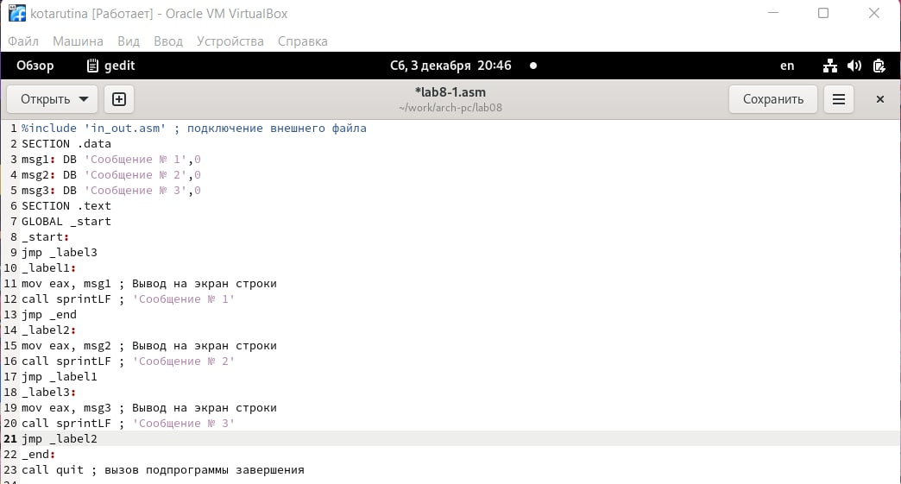{ #fig:006 width=70% }

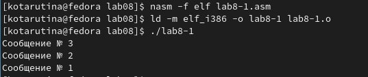{ #fig:007 width=70% }

Создаю файл lab8-2.asm в каталоге ~/work/arch-pc/lab08. Внимательно
изучаю текст программы из листинга 8.3 и ввожу в lab8-2.asm(рис. [-@fig:008] - [-@fig:009])

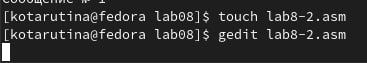{ #fig:008 width=70% }

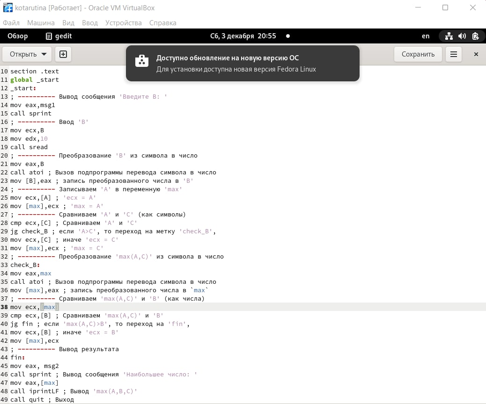{ #fig:009 width=70% }

Создаю исполняемый файл и проверяю его работу для разных значений B(рис. [-@fig:0010])

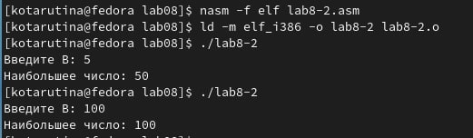{ #fig:0010 width=70% }

Открываю файл листинга lab8-2.lst с помощью любого текстового редактора mcedit. Внимательно ознакомливаюсь с его форматом и содержимым(рис. [-@fig:0011] - [-@fig:0012])

Рассмотрим строку под номером 34(в листинге, а не в исходном тексте программы). В ней инструкция
mov eaw, max начинается по смещению 00000130 в сегменте кода; далее идёт
машинный код, в который ассемблируется инструкция, то есть инструкция
mov eax, max ассемблируется в B8[00000000]. В конце же строки представлена непосредственно инструкция.

Также рассмотрим строку под номером 40(в листинге, а не в исходном тексте программы). В ней инструкция
jg fin начинается по смещению 0000014B в сегменте кода; далее идёт
машинный код, в который ассемблируется инструкция, то есть инструкция
jg fin ассемблируется в 7F0C. В конце же строки представлена непосредственно инструкция.

Рассмотрим 49 строку листинга, где 49 - номер строки, 0000016D - смещение команды в сегменте кода, E869FFFFFF - машинный код ассэмблерной команды call quit

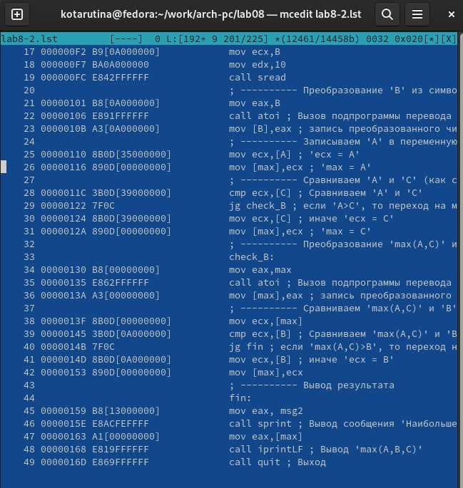{ #fig:0011 width=70% }

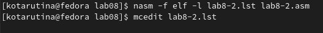{ #fig:0012 width=70% }

При попытке редактирования инструкции с двумя операндами и удаления одной из них выводится следующая ошибка(рис. [-@fig:0013])

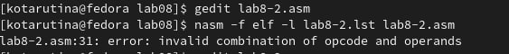{ #fig:0013 width=70% }

# Выполнение самостоятельной работы

Создаю программу нахождения наименьшего числа среди целочисленный a, b и c (рис. [-@fig:0014] - [-@fig:0015])
Вариант 9

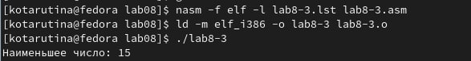{ #fig:0014 width=70% }

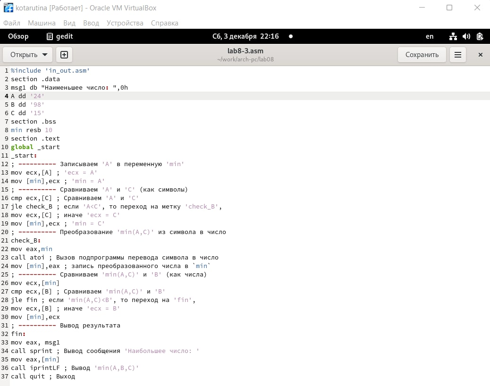{ #fig:0015 width=70% }

Создаю программу по вычислению значений заданной функции для x и a(рис. [-@fig:0016])

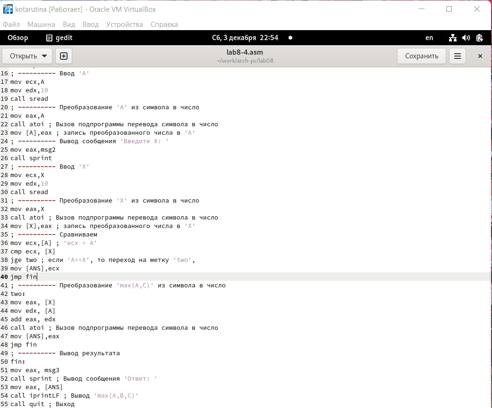{ #fig:0016 width=70% }

# Выводы

Изучение команд условного и безусловного переходов. Приобретение навыков написания программ с использованием переходов. Знакомство с назначением и структурой файла листинга прошло успешно

