---
## Front matter
title: "Отчёт по лабораторной работе №9"
author: "Тарутина Кристина Олеговна"

## Generic otions
lang: ru-RU
toc-title: "Содержание"

## Bibliography
bibliography: bib/cite.bib
csl: pandoc/csl/gost-r-7-0-5-2008-numeric.csl

## Pdf output format
toc: true # Table of contents
toc-depth: 2
lof: true # List of figures
lot: true # List of tables
fontsize: 12pt
linestretch: 1.5
papersize: a4
documentclass: scrreprt
## I18n polyglossia
polyglossia-lang:
  name: russian
  options:
	- spelling=modern
	- babelshorthands=true
polyglossia-otherlangs:
  name: english
## I18n babel
babel-lang: russian
babel-otherlangs: english
## Fonts
mainfont: PT Serif
romanfont: PT Serif
sansfont: PT Sans
monofont: PT Mono
mainfontoptions: Ligatures=TeX
romanfontoptions: Ligatures=TeX
sansfontoptions: Ligatures=TeX,Scale=MatchLowercase
monofontoptions: Scale=MatchLowercase,Scale=0.9
## Biblatex
biblatex: true
biblio-style: "gost-numeric"
biblatexoptions:
  - parentracker=true
  - backend=biber
  - hyperref=auto
  - language=auto
  - autolang=other*
  - citestyle=gost-numeric
## Pandoc-crossref LaTeX customization
figureTitle: "Рис."
tableTitle: "Таблица"
listingTitle: "Листинг"
lofTitle: "Список иллюстраций"
lotTitle: "Список таблиц"
lolTitle: "Листинги"
## Misc options
indent: true
header-includes:
  - \usepackage{indentfirst}
  - \usepackage{float} # keep figures where there are in the text
  - \floatplacement{figure}{H} # keep figures where there are in the text
---

# Цель работы

Приобретение навыков написания программ с использованием циклов и
обработкой аргументов командной строки.

# Выполнение лабораторной работы
Создаю каталог для программам лабораторной работы № 9, перейхожу в
него и создаю файл lab9-1.asm(рис. [-@fig:001])

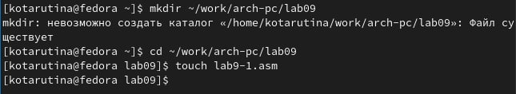{ #fig:001 width=70% }

Ввожу в файл lab9-1.asm текст программы из листинга 9.1(рис. [-@fig:002])

{ #fig:002 width=70% }

Создаю исполняемый файл и запускаю его.(рис. [-@fig:003])
Работа программы корректна, при введении числа 5 происходит 5 повторов цикла, в терминал выводится значения от 5 до 1 в убывающим порядке, соответствующее отсчёту оборотов цикла

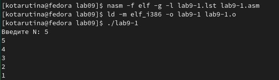{ #fig:003 width=70% }

Изменяю текст программы(рис. [-@fig:004])

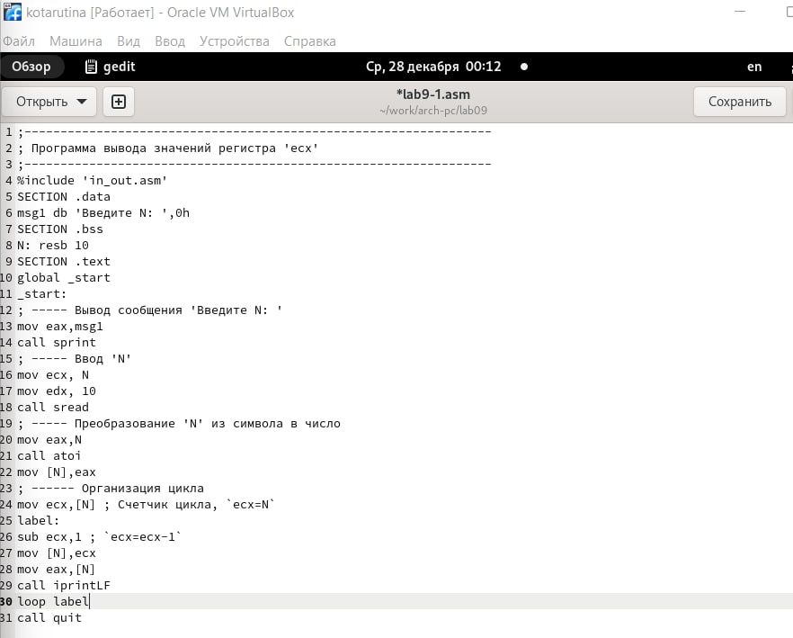{ #fig:004 width=70% }

Создаю исполняемый файл и проверяю его работу(рис. [-@fig:005])
Программа начинает работать не корректно, после отсчёта нуля(причём шаг не единица, а два), мы переходим на огромные значения

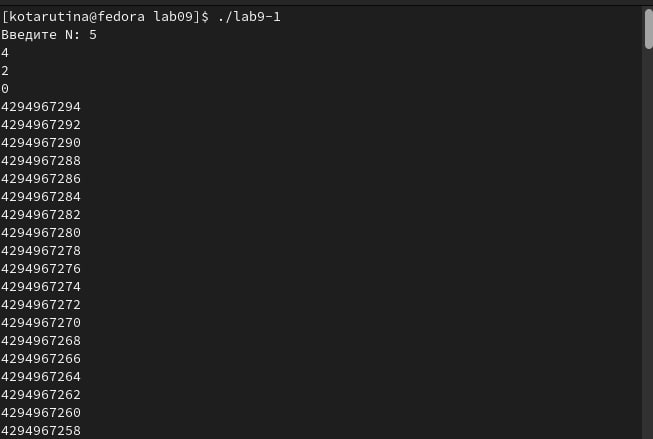{ #fig:005 width=70% }

Снова изменяю текст программы(рис. [-@fig:006]) 

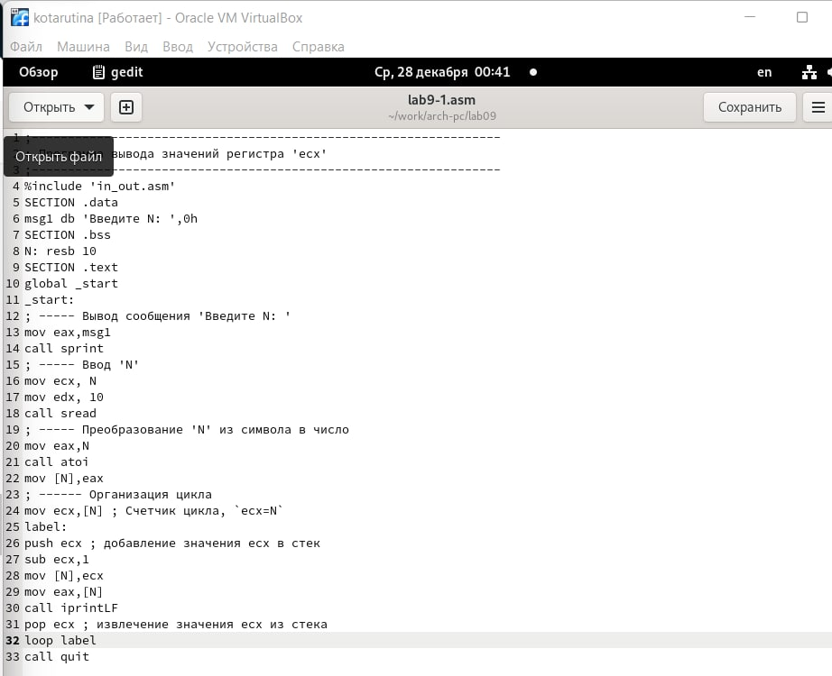{ #fig:006 width=70% }

Создаю исполняемый файл и проверяю его работу(рис. [-@fig:007])
Работа файла снова корректна, но в отличии от первой версии программы, счёт ведётся не от N-ного элемента и до 1, а от N - 1 и до 0

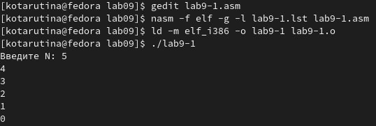{ #fig:007 width=70% }

Создаю файл lab9-2.asm в каталоге ~/work/arch-pc/lab09. Внимательно
изучаю текст программы из листинга 9.2 и ввожу в lab9-2.asm(рис. [-@fig:008]) 

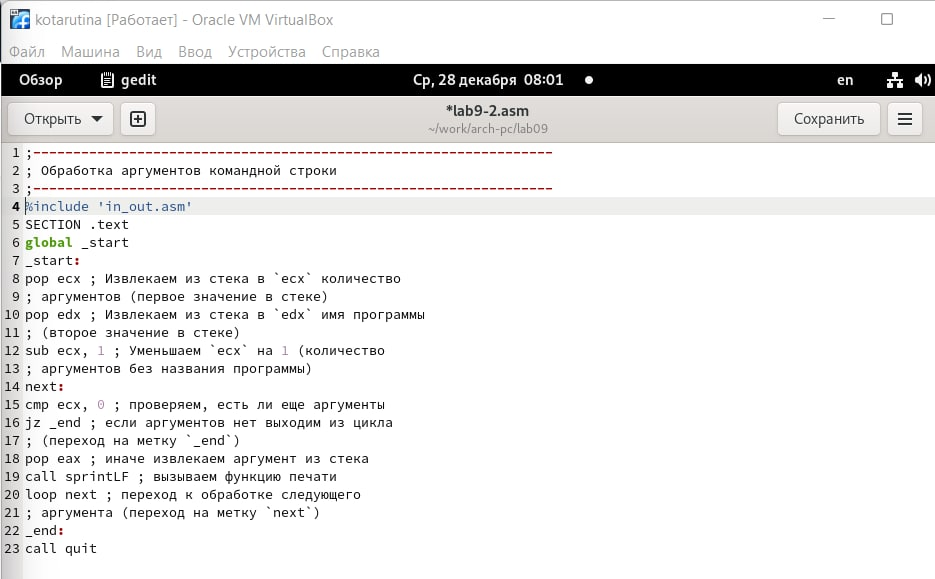{ #fig:008 width=70% }

Создаю исполняемый файл и запускаю его. (рис. [-@fig:009])
В данном случае было обработано 4 аргумента, так как часть строки "аргумент 2" разделена пробелом и не имеет '' данных символов, а значит воспринимается как два разных аргумента

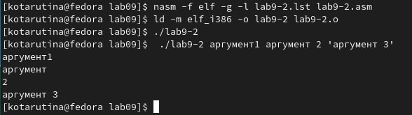{ #fig:009 width=70% }

Создаю файл lab9-3.asm в каталоге ~/work/arch-pc/lab09. Внимательно
изучаю текст программы из листинга 9.3 и ввожу в lab9-3.asm(рис. [-@fig:0010])

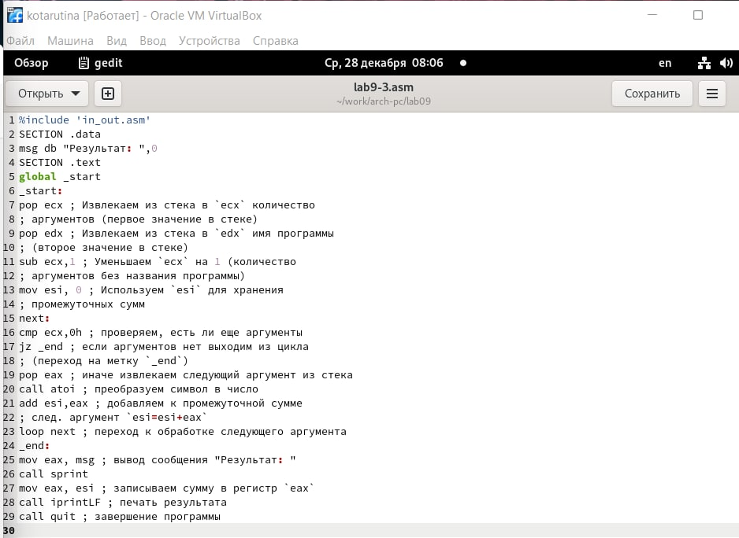{ #fig:0010 width=70% }

Создаю исполняемый файл и запускаю его. (рис. [-@fig:0011])

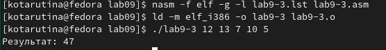{ #fig:0011 width=70% }

Изменяю текст программы из листинга 9.3 для вычисления произведения
аргументов командной строки.
(рис. [-@fig:0012])

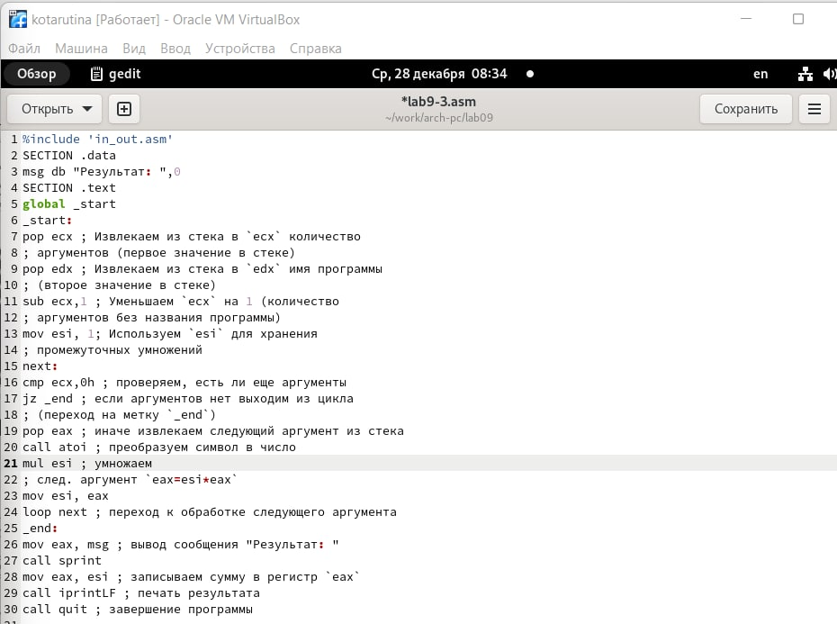{ #fig:0012 width=70% }

Создаю исполняемый файл и запускаю его(рис. [-@fig:0013])

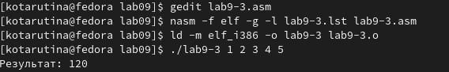{ #fig:0013 width=70% }

# Выполнение самостоятельной работы

Пишу программу, которая находит сумму значений функции 𝑓(𝑥) для 𝑥 = 𝑥1, 𝑥2, ..., 𝑥𝑛, т.е. программа должна выводить значение 𝑓(𝑥1) +𝑓(𝑥2)+...+𝑓(𝑥𝑛).(рис. [-@fig:0014])
Вариант 9

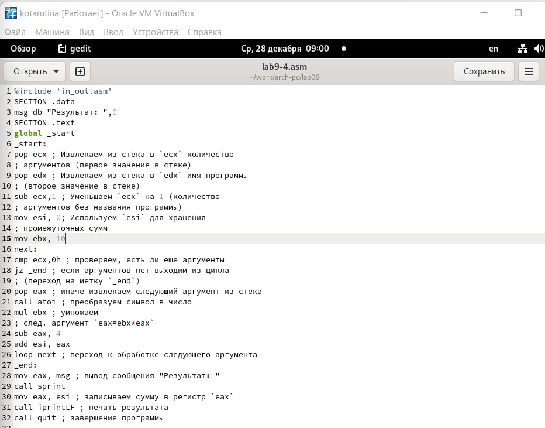{ #fig:0014 width=70% }

Создаю программу по вычислению значений заданной функции для последовательности x(рис. [-@fig:0015])

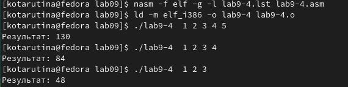{ #fig:0015 width=70% }

# Выводы

Приобретение навыков написания программ с использованием циклов и
обработкой аргументов командной строки прошло успешно

