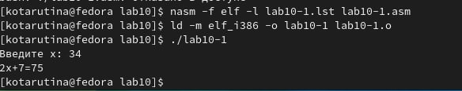

---
## Front matter
title: "Отчёт по лабораторной работе №10"
author: "Тарутина Кристина Олеговна"

## Generic otions
lang: ru-RU
toc-title: "Содержание"

## Bibliography
bibliography: bib/cite.bib
csl: pandoc/csl/gost-r-7-0-5-2008-numeric.csl

## Pdf output format
toc: true # Table of contents
toc-depth: 2
lof: true # List of figures
lot: true # List of tables
fontsize: 12pt
linestretch: 1.5
papersize: a4
documentclass: scrreprt
## I18n polyglossia
polyglossia-lang:
  name: russian
  options:
	- spelling=modern
	- babelshorthands=true
polyglossia-otherlangs:
  name: english
## I18n babel
babel-lang: russian
babel-otherlangs: english
## Fonts
mainfont: PT Serif
romanfont: PT Serif
sansfont: PT Sans
monofont: PT Mono
mainfontoptions: Ligatures=TeX
romanfontoptions: Ligatures=TeX
sansfontoptions: Ligatures=TeX,Scale=MatchLowercase
monofontoptions: Scale=MatchLowercase,Scale=0.9
## Biblatex
biblatex: true
biblio-style: "gost-numeric"
biblatexoptions:
  - parentracker=true
  - backend=biber
  - hyperref=auto
  - language=auto
  - autolang=other*
  - citestyle=gost-numeric
## Pandoc-crossref LaTeX customization
figureTitle: "Рис."
tableTitle: "Таблица"
listingTitle: "Листинг"
lofTitle: "Список иллюстраций"
lotTitle: "Список таблиц"
lolTitle: "Листинги"
## Misc options
indent: true
header-includes:
  - \usepackage{indentfirst}
  - \usepackage{float} # keep figures where there are in the text
  - \floatplacement{figure}{H} # keep figures where there are in the text
---

# Цель работы

Приобретение навыков написания программ с использованием подпрограмм.
Знакомство с методами отладки при помощи GDB и его основными возможностями.

# Выполнение лабораторной работы
Создаю каталог для выполнения лабораторной работы № 10, перехожу
в него и создаю файл lab10-1.asm(рис. [-@fig:001])

{ #fig:001 width=70% }

Ввожу в файл текст их листинга 10.1(рис. [-@fig:002])

{ #fig:002 width=70% }

Создаю исполняемый файл и проверяю его работу. Программа не работает из-за ошибок в обозначении(рис. [-@fig:003])

{ #fig:003 width=70% }

Нахожу ошибки. Заменяю rezs на rez и res на rez(рис. [-@fig:004])

{ #fig:004 width=70% }

Снова создаю исполняемый файл и запускаю. Программа работает корректно(рис. [-@fig:005])

{ #fig:005 width=70% }

Изменяю текст программы, добавив подпрограмму _subcalcul в подпрограмму _calcul(рис. [-@fig:006]) создаю исполняемый файл и проверяю его работу (рис. [-@fig:007])

{ #fig:006 width=70% }

{ #fig:007 width=70% }

Создаю файл lab10-2.asm с текстом программы из Листинга 10.2, получаю исполняемый файл и загружаю его в отладчик gdb[-@fig:008] - [-@fig:009])

{ #fig:008 width=70% }

{ #fig:009 width=70% }

Запускаю программу в оболочке GDB с помощью команды run(рис. [-@fig:0010])

{ #fig:0010 width=70% }

Устанавливаю брейкпоинт на метку _start, с которой начинается выполнение любой ассемблерной программы, и
запускаю её. (рис. [-@fig:0011])

{ #fig:0011 width=70% }

Смотрю дисассимилированный код программы с помощью команды disassemble начиная с метки _start (рис. [-@fig:0011])

{ #fig:0012 width=70% }

Переключаюсь на отображение команд с Intel’овским синтаксисом, введя
команду set disassembly-flavor intel(рис. [-@fig:0013])

{ #fig:0013 width=70% }

Различия в синтаксисах в том, что в первом отображаются спецсимволы в четвёртой колонке(где отображаются переменные), а во втором нет

Включаю режим псевдографики для более удобного анализа программы (рис. [-@fig:0014])

{ #fig:0014 width=70% }

На предыдущих шагах была установлена точка останова по имени метки
(_start). Проверяю это с помощью команды info breakpoints(рис. [-@fig:0015])

{ #fig:0015 width=70% }

Определяю адрес предпоследней инструкции (mov
ebx,0x0) и установливаю точку останова. Смотрю информацию о всех установленных точках останова(рис. [-@fig:0016])

{ #fig:0016 width=70% }

Выполняю 5 инструкций с помощью команды stepi (или si)
Изменяются регистры eax, ebx, ecx, edx
Смотрю содержимое регистров с помощью команды info
registers(рис. [-@fig:0017] - [-@fig:0018])

{ #fig:0017 width=70% }

{ #fig:0018 width=70% }

Смотрю значение переменной msg1 по имени и значение переменной msg2 по адресу(рис. [-@fig:0019])

{ #fig:0019 width=70% }

Изменяю первый символ
переменной msg1 и msg2(рис. [-@fig:0020])

{ #fig:0020 width=70% }

С помощью команды set изменяю значение регистра ebx(рис. [-@fig:0021])

{ #fig:0021 width=70% }

КОпирую файл lab9-2.asm, созданный при выполнении лабораторной работы №9, создаю тсполняемый файл(рис. [-@fig:0022])

{ #fig:0022 width=70% }

Загружаю исполняемый файл в отладчик, указав аргументы(рис. [-@fig:0023])

{ #fig:0023 width=70% }

УСтанавливаю точку останова перед первой инструкцией в программе
и запускаю ее.(рис. [-@fig:0024])

{ #fig:0024 width=70% }

Просматриваю позиции стеков(рис. [-@fig:0025] - [-@fig:0026])

{ #fig:0025 width=70% }

{ #fig:0026 width=70% }

Размер переменной будет четыре байта. А шаг равен размеру переменной

# Выполнение самостоятельной работы

Преобразую программу из лабораторной работы номер 9(мой вариант 9)(рис. [-@fig:0027] - [-@fig:0028])

{ #fig:0027 width=70% }

{ #fig:0028 width=70% }

Создаю файл и записываю в него текст программы. Проверяю работ. Программа выводит неверный ответ. Загружаю файл в отладчик(рис. [-@fig:0029])

{ #fig:0029 width=70% }

Устанавливаю точку и запускаю программу(рис. [-@fig:0030])

{ #fig:0030 width=70% }

Делаю первые три шага, не замечаю ошибки на данном этапе(рис. [-@fig:0031])

{ #fig:0031 width=70% }

Делаю ещё два шага. Программа умножает между собой неверные переменные( должно быть (3+2)*4, но происходит 2*4)(рис. [-@fig:0032])

{ #fig:0032 width=70% }

Делаю ещё один шаг. ПО итогу программа умножает неверные переменные и прибавляет пять к переменной, которая не была умножена на 4(рис. [-@fig:0033])

{ #fig:0033 width=70% }

Исправляю ошибку в программе(рис. [-@fig:0034])

{ #fig:0034 width=70% }

Создаю исполняемый файл и проверяю работу программы(рис. [-@fig:0035])

{ #fig:0035 width=70% }

# Выводы

Приобретение навыков написания программ с использованием подпрограмм.
Знакомство с методами отладки при помощи GDB и его основными возможностями прошло успешно

